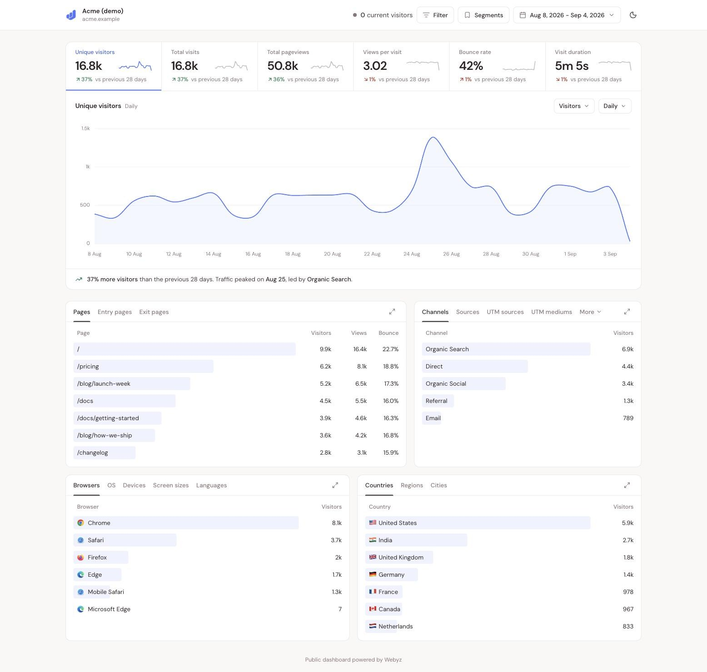

<p align="center">
  
</p>

<h1 align="center">Webyz</h1>

<p align="center">
  Privacy-first web analytics you can read in a minute and run on your own server.<br>
  No cookies, no fingerprinting across days, no personal data. A 5 KB script, a Fastify API, ClickHouse for the numbers.
</p>

<p align="center">
  <a href="https://github.com/webyz-org/webyz/actions/workflows/ci.yml"></a>
  <a href="LICENSE"></a>
  <a href="https://github.com/webyz-org/webyz/pkgs/container/webyz-api"></a>
</p>

<p align="center">
  <a href="https://webyz.io">Website</a> ·
  <a href="docs/self-hosting.md">Self-host</a> ·
  <a href="docs/tracker.md">Tracker</a> ·
  <a href="docs/api.md">API</a> ·
  <a href="docs/development.md">Develop</a> ·
  <a href="CONTRIBUTING.md">Contribute</a>
</p>

<p align="center">
  
</p>

## Why Webyz

Most sites need one page of numbers: how many people came, from where, what they read, whether they converted. Google Analytics answers that with a cookie banner, a hundred reports and data that leaves your servers. Webyz answers it with a single script and a single dashboard, counts visitors without storing anything about them, and runs on one small server you control. The code is AGPL; the hosted service at [webyz.io](https://webyz.io) runs exactly this repository.

## Features

- **Overview** of visitors, visits, pageviews, views per visit, bounce rate and visit duration, each compared with the previous period, with a graph at minute, hour, day, week or month resolution.
- **Breakdowns** by page, entry and exit page, channel, source, UTM parameters, browser, OS, device, screen size, language, country, region and city. Click a row to drill down (browser to versions, country to regions to cities); every filter lives in the URL so a view is a link.
- **Filters** with `is`, `is not`, `contains` and `does not contain`, on any dimension plus goals and custom events. Save a set as a **segment** and apply it in one click.
- **Realtime**: who is on the site right now on a world map, what they are looking at, and a live stream of activity.
- **Goals, funnels and custom events** from event names or page paths, analysed live in ClickHouse. Custom event **properties** are broken down per value, so "Signup by plan" is two clicks.
- **Automatic events** from the tracker: outbound link clicks, file downloads and 404 pages, each switched on by one attribute. Single-page apps and hash-based routers are followed without code.
- **User journeys**: the paths visitors take between pages, with the events they fire along the way.
- **Google Search Console** queries and rankings next to your traffic, pulled live from Google and never stored.
- **Email reports** every week or month and **traffic spike alerts**, per site.
- **Public dashboards** by unguessable link, optionally behind a password, embeddable in an iframe.
- **Team members** per site, invited by email as admin or viewer.
- **CSV export** of every breakdown and the time series, and a **read-only HTTP API** with personal keys.
- **Light and dark** dashboard, reporting in each site's own timezone.
- **Plans and usage metering** with Paddle, optional. A self-hosted install runs on the free plan with nothing enforced against a card.

## How it stays private

The tracker sets no cookies and writes nothing to the browser. Visitors are counted on the server with a hash of the site, IP address, user agent and a random salt that changes every day, so the same person is one visitor within a day and unlinkable across days. The IP is used for that hash and a local country lookup, then dropped; it is never stored. Do Not Track is honoured by default and visitors can opt out. The tracker is about 5 KB gzipped and loads with `defer`. The full statement is in [`apps/web/src/app/privacy`](apps/web/src/app/privacy/page.tsx), which is what the hosted service publishes.

## Getting started

### Hosted

Sign up at [app.webyz.io](https://app.webyz.io/signup), add a website, paste the snippet. Every account starts with a 30 day trial of the Growth plan.

### Self-hosted

You need a Linux server with Docker and a domain pointing at it.

```bash
git clone https://github.com/webyz-org/webyz.git
cd webyz/infra
./setup.sh analytics.example.com
docker compose up -d
```

That is the whole install: Postgres, ClickHouse, Redis, the API, the dashboard, and Caddy in front with automatic TLS, all on one domain. Migrations and the plan seed run before the API starts. Prebuilt images are pulled from GitHub Container Registry; `docker compose build` builds them from the checkout instead. Signups are closed after the first account. Already have a reverse proxy? The [self-hosting guide](docs/self-hosting.md) covers that, updates, backups and troubleshooting.

Then open `https://analytics.example.com`, create the first account, add a website, and paste the snippet it gives you into the `<head>` of your site:

```html
<script defer src="https://analytics.example.com/js/script.js"
  data-site-id="YOUR_SITE_ID"
  data-endpoint="https://analytics.example.com/api/v1/track"></script>
```

Updating is `git pull`, then `docker compose pull && docker compose up -d` in `infra/`. Breaking changes are listed under their own heading in the [changelog](CHANGELOG.md).

## Documentation

| Guide | What it covers |
| --- | --- |
| [Self-hosting](docs/self-hosting.md) | Install in one command, configuration, updates, your own reverse proxy, backups, troubleshooting |
| [Configuration](docs/configuration.md) | Every environment variable for the API and the dashboard |
| [Tracker](docs/tracker.md) | Installing the script, options, custom events, automatic events, SPA routing, opt-out, what is collected |
| [API](docs/api.md) | Authentication, endpoints, periods and filters, exports, errors, rate limits |
| [Development](docs/development.md) | Running locally, tests, project layout, conventions, releases |
| [Architecture](docs/architecture.md) | How events flow from the script to the dashboard, and why the data model looks the way it does |

The same guides are published at [webyz.io/docs](https://webyz.io/docs). `CLAUDE.md` at the repo root is the detailed engineering reference used by contributors and by AI assistants working in this repository; it is kept accurate and is worth reading before a non-trivial change.

## Tech stack

Node 22, pnpm workspaces and Turborepo. The API is Fastify 5 with Prisma on Postgres for accounts and billing and ClickHouse for events and sessions, Redis for caches and locks. The dashboard is Vite, React 19 and TanStack Query. The marketing site is Next.js. Paddle, Resend, Google OAuth and MaxMind GeoLite2 are optional integrations that switch on when their keys are set.

## Status

Webyz is in beta. The hosted service and this repository are the same code. Breaking changes to the tracker script, the HTTP API and the self-hosting configuration are called out in the [changelog](CHANGELOG.md) before they ship.

## Contributing

Bug reports, fixes and documentation improvements are welcome. Read [CONTRIBUTING.md](CONTRIBUTING.md) for how the project works, [CODE_OF_CONDUCT.md](CODE_OF_CONDUCT.md) for how we treat each other, and [SECURITY.md](SECURITY.md) for how to report a vulnerability privately.

## License

Webyz is licensed under the [GNU Affero General Public License v3.0](LICENSE). You can run it, change it and redistribute it; if you offer a modified version as a service, you must make your changes available to its users under the same licence. The Webyz name and logo are not covered by the licence.
