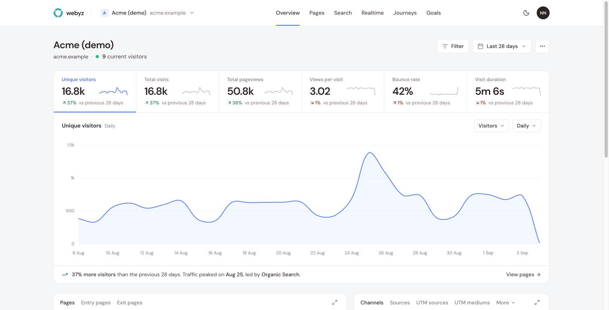

<p align="center">
  
</p>

<h1 align="center">Webyz</h1>

<p align="center">
  Privacy-first web analytics you can read in a minute and run on your own server.<br>
  No cookies, no fingerprinting across days, no personal data. A 4 KB script, a Fastify API, ClickHouse for the numbers.
</p>

<p align="center">
  <a href="LICENSE">AGPL-3.0</a> ·
  <a href="docs/self-hosting.md">Self-host</a> ·
  <a href="docs/tracker.md">Tracker</a> ·
  <a href="docs/api.md">API</a> ·
  <a href="docs/development.md">Develop</a> ·
  <a href="CONTRIBUTING.md">Contribute</a>
</p>

<p align="center">
  
</p>

## What it does

- **Overview** of visitors, visits, pageviews, views per visit, bounce rate and visit duration, each compared with the previous period.
- **Breakdowns** by page, entry and exit page, channel, source, UTM parameters, browser, OS, device, screen size, language, country, region and city, with Plausible-style drill-down filters that live in the URL: click a row for "is", or type "is not", "contains" and "does not contain". Filter by goal or custom event, and save any set of filters as a **segment**.
- **Realtime** visitors on a map and a live stream of what they are doing.
- **Goals and funnels** from custom events or page paths, analysed live in ClickHouse, with **custom event properties** broken down per value. The tracker counts **outbound links, file downloads and 404s** with one attribute each, and follows hash-based routers.
- **User journeys**: the paths visitors take between pages, with events along the way.
- **Google Search Console** queries next to your traffic, pulled live and never stored.
- **CSV export** of every breakdown and the time series, and a **read-only HTTP API** with personal keys.
- **Public dashboards** by unguessable link, per site, optionally behind a password, embeddable in an iframe.
- **Team members** per site: invite by email as admin or viewer, seats from the owner's plan.
- **Email reports** every week or month and **traffic spike alerts**, per site.
- **Plans and usage metering** with Paddle, optional; self-hosters run everything on the free plan with no limits enforced against a card.

## How it stays private

The tracker sets no cookies and writes nothing to the browser. Visitors are counted on the server with a hash of the site, IP address, user agent and a random salt that changes every day, so the same person is one visitor within a day and unlinkable across days. The IP is used for that hash and a local country lookup, then dropped; it is never stored. Do Not Track is honoured by default and visitors can opt out. The full statement is in [`apps/web/src/app/privacy`](apps/web/src/app/privacy/page.tsx), which is what the hosted service publishes.

## Quick start

You need a Linux server with Docker, and a domain pointing at it.

```bash
git clone https://github.com/webyz-org/webyz.git
cd webyz/infra
./setup.sh analytics.example.com
docker compose up -d
```

That is the whole install: Postgres, ClickHouse, Redis, the API, the dashboard, and Caddy in front with automatic TLS, all on one domain. Migrations and the plan seed run before the API starts. Prebuilt images are pulled from GitHub Container Registry; `docker compose build` builds them from the checkout instead. Already have a reverse proxy? The [self-hosting guide](docs/self-hosting.md) covers that too.

Then open `https://analytics.example.com`, create the first account, add a website, and paste the snippet it gives you:

```html
<script defer src="https://analytics.example.com/js/script.js"
  data-site-id="YOUR_SITE_ID"
  data-endpoint="https://analytics.example.com/api/v1/track"></script>
```

## Documentation

| Guide | What it covers |
| --- | --- |
| [Self-hosting](docs/self-hosting.md) | Install in one command, configuration, updates, your own reverse proxy, backups |
| [Configuration](docs/configuration.md) | Every environment variable for the API and the dashboard |
| [Tracker](docs/tracker.md) | Installing the script, options, custom events, SPA routing, opt-out, what is collected |
| [API](docs/api.md) | Authentication, endpoints, periods and filters, exports, errors, rate limits |
| [Development](docs/development.md) | Running locally, tests, project layout, conventions |
| [Architecture](docs/architecture.md) | How events flow from the script to the dashboard, and why the data model looks the way it does |

`CLAUDE.md` at the repo root is the detailed engineering reference used by contributors and by AI assistants working in this repository; it is kept accurate and is worth reading before a non-trivial change.

## Tech stack

Node 22, pnpm workspaces and Turborepo. The API is Fastify 5 with Prisma on Postgres for accounts and billing and ClickHouse for events and sessions, Redis for caches and locks. The dashboard is Vite, React 19 and TanStack Query. The marketing site is Next.js. Paddle, Resend, Google OAuth and MaxMind GeoLite2 are optional integrations that switch on when their keys are set.

## Status

Webyz is in beta. The hosted service and this repository are the same code. Breaking changes to the tracker script and the API will be announced in release notes before they ship.

## Contributing

Bug reports, fixes and documentation improvements are welcome. Read [CONTRIBUTING.md](CONTRIBUTING.md) for how the project works and [SECURITY.md](SECURITY.md) for how to report a vulnerability privately.

## License

Webyz is licensed under the [GNU Affero General Public License v3.0](LICENSE). You can run it, change it and redistribute it; if you offer a modified version as a service, you must make your changes available to its users under the same licence. The Webyz name and logo are not covered by the licence.
